# Dark Mode theme for VS code

[](https://marketplace.visualstudio.com/items?itemName=jugal13.jugal13-theme) [](https://marketplace.visualstudio.com/items?itemName=jugal13.jugal13-theme)

[Repository](https://github.com/jugalw13/jugal13-vscode-theme)

- [Getting started](#getting-started)
  - [Installation](#installation)
  - [Pre-requisite](#prerequisite)
- [Activation](#activation)
- [Override theme colors](#override-theme-colors)
  - [Color Scheme override](#color-scheme-override)
- [textMate Rules](#textMate-rules)
- [Screenshots](#screenshots)
  - [Flutter Dart](#flutter-dart)
  - [HTML](#html)
  - [CSS](#css)
  - [SCSS](#scss)
  - [JS](#js)
  - [TS](#ts)
  - [Python](#python)
  - [C](#c)
  - [C++](#c++)
  - [SQL](#sql)

## Getting started

You can install this theme through [Visual Studio Code Marketplace](https://marketplace.visualstudio.com/items?itemName=jugal13.jugal13-theme).

## Installation

1. Open extensions tab
2. Search jugal13
3. Click install

## Prerequisite

The list of extensions are being used with the theme

1. Bracket Pair Colorizer 2
2. Todo Tree
3. Material Icon Theme
4. Better Comments

## Activation

1. Open Command Pallete
2. Preferences: Color Scheme
3. Select jugal13-theme

## Override theme colors

[Overriding Colours Documentation](https://code.visualstudio.com/docs/getstarted/themes#_customizing-a-color-theme)

### Color Scheme override

**Example (Syntax Colours without textMate Rules)**

```json
"editor.tokenColorCustomizations": {
    "[jugal13-theme]": {
        "comments": "#229977"
    }
},
```

**Example (Syntax Colours using textMate Rules)**

```json
"editor.tokenColorCustomizations": {
    "[jugal13-theme]": {
        "textMateRules": [
            {
                "name": "Variables",
                "scope": ["variable", "string constant.other.placeholder"],
                "settings": {
                    "foreground": "#EEFFFF"
                }
            },
        ]
    },
},

"workbench.colorCustomizations": {
	"[jugal13-theme]": {
		"activityBar.activeBorder": "#ff33ff",
        "activityBar.background": "#111111",
        "activityBar.border": "#333333",
        "activityBar.dropBackground": "#ff0033",
        "activityBar.foreground": "#ffffff",
        "activityBar.inactiveForeground": "#00ffbd",
        "activityBarBadge.background": "#ff0000",
        "activityBarBadge.foreground": "#000000",
	}
},
```

## textMate Rules

1. Open Command Palette
2. Select `Developer: Inspect Editor Tokens and Scopes`
3. Place cursor to identify the scope of the element in the file

[Video](images/textMate.mov)

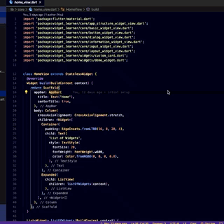

## Screenshots

### Flutter Dart

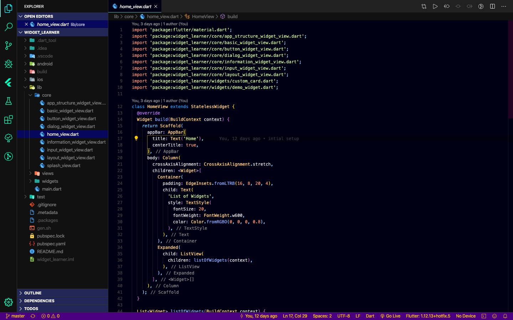

### HTML

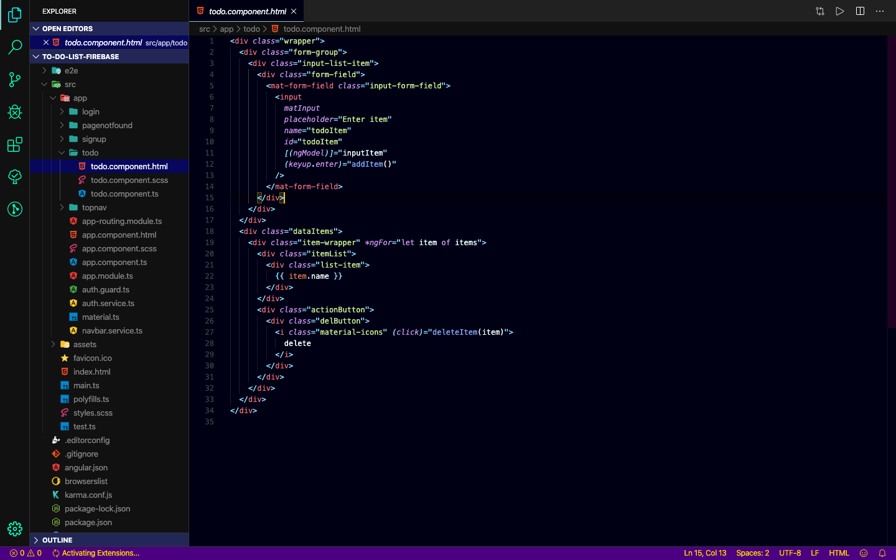

### CSS

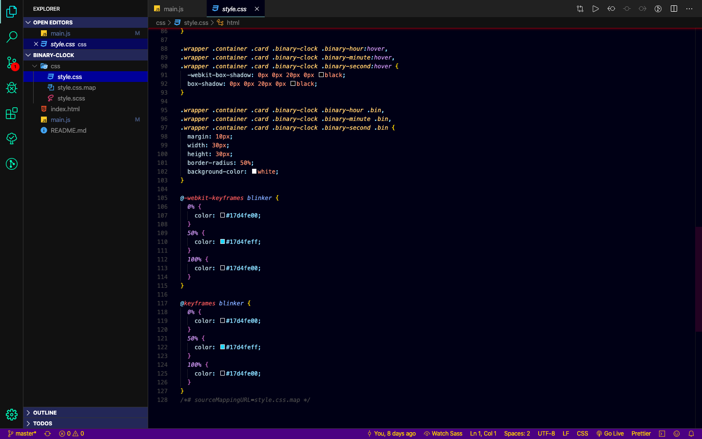

### SCSS

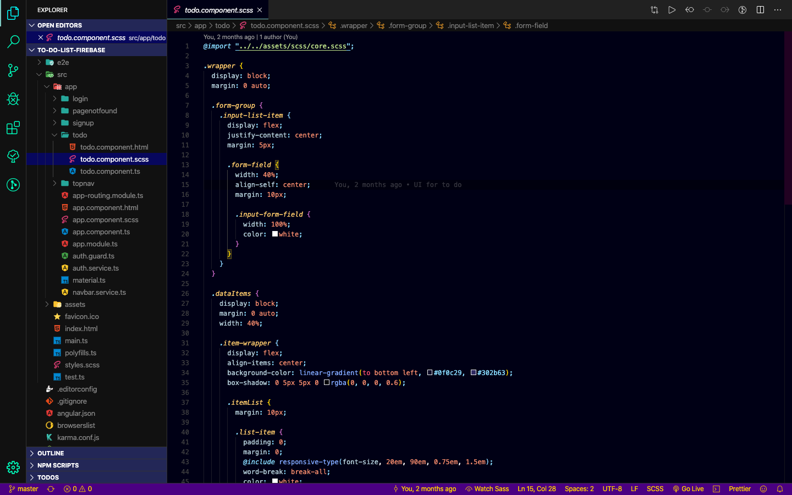

### JS

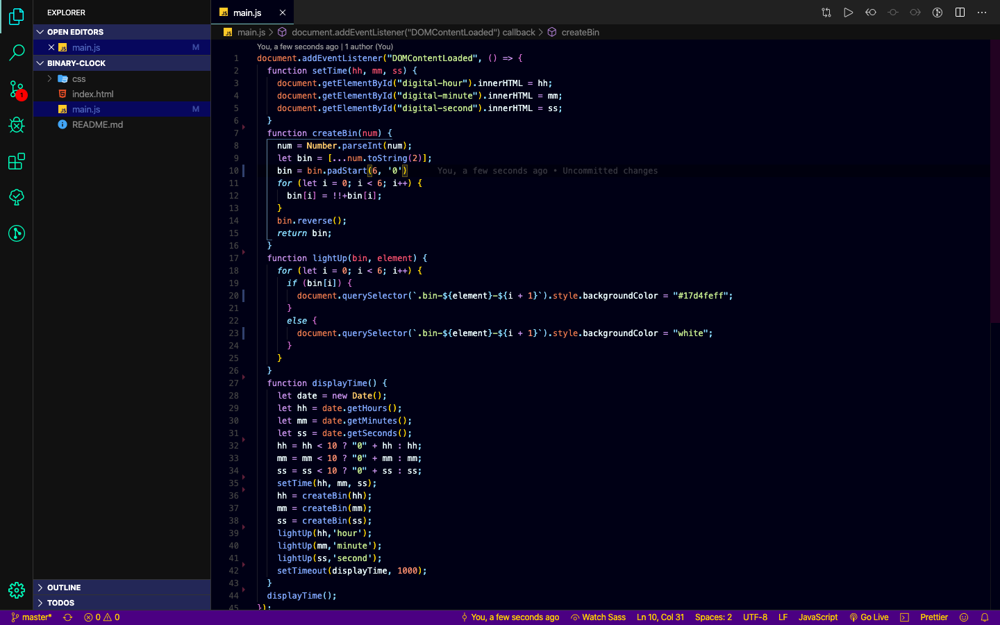

### TS

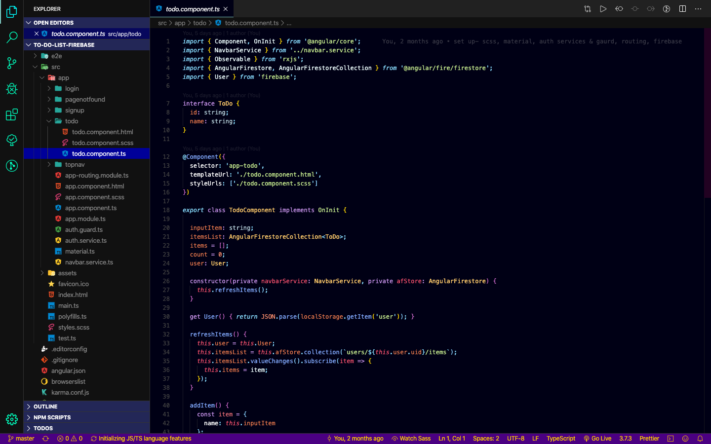

### Python

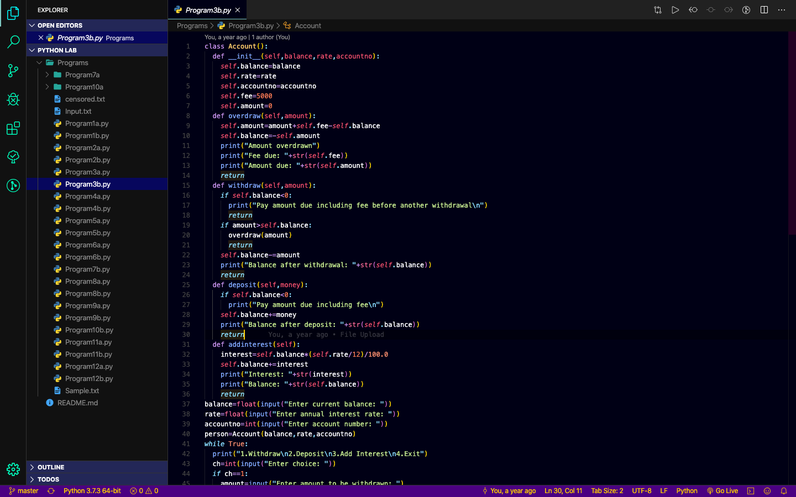

### C

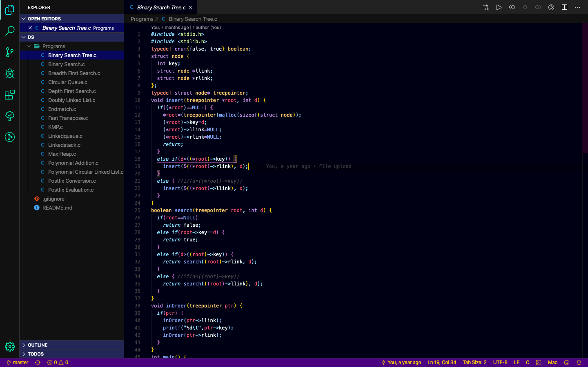

### C++

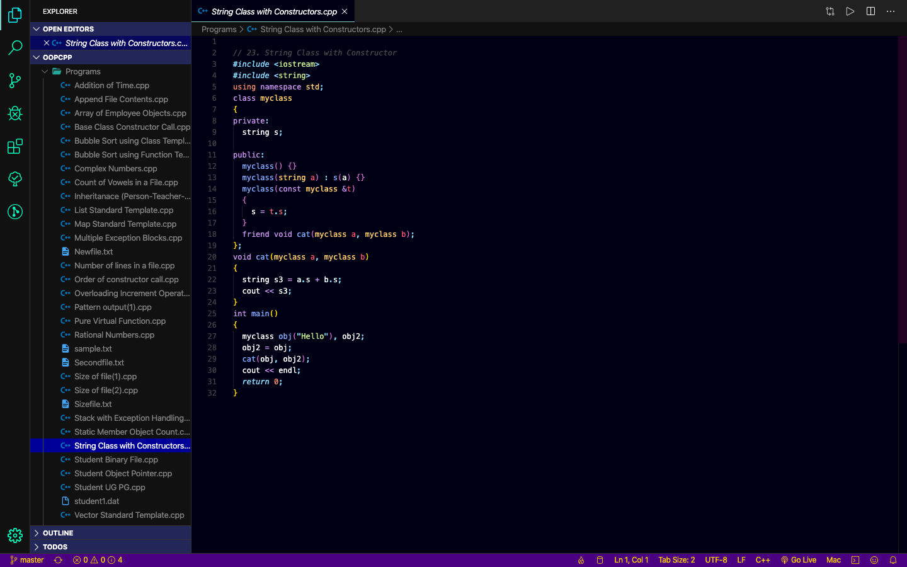

### SQL

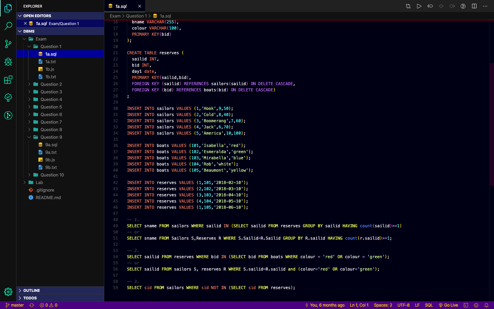
